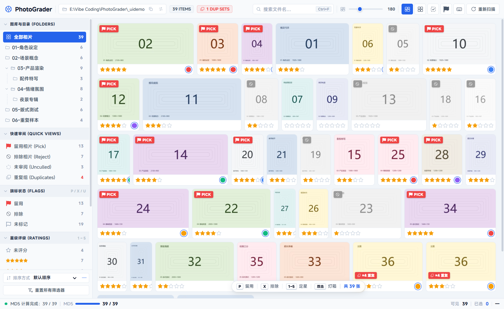

# PhotoGrader

**把照片的评分写进照片自己身上** —— 一个本地优先的 PNG 图片筛选与重复清理工具。

基于 .NET 8 + WPF + WebView2，界面参照 Lightroom 的筛选工作流：星级、旗标、彩色标签三个维度正交打分，配合目录树、快速审阅和内容级重复检测，用来快速过一遍成百上千张图。



---

## 核心特性

### 评分直接存进 PNG 文件，不依赖任何数据库

这是它与多数同类工具最大的区别。每张图的星级 / 旗标 / 标签被序列化成 JSON，
写进 PNG 尾部一个自定义的 `iTXt` 块（keyword = `PhotoGrader`）。

- **零外部依赖** —— 没有 sidecar 文件、没有 SQLite、没有隐藏目录。把图片单独拷走，评分跟着走。
- **像素数据不动** —— 只在 `IEND` 之前插入块，`IDAT` 与所有图像数据保持原样，任何标准看图软件照常打开。
- **定长设计** —— 块体固定 512 字节，因此块位置恒等于「文件长度 − 536」，读和覆盖都是一次定位，不必扫描整个文件。首次写入让文件增长 524 字节，之后原地覆盖。
- **可校验** —— 块带 CRC-32；被截断或损坏时能识别出来，不会静默读出脏数据。

### 内容级重复检测

按 MD5 找出内容完全相同的文件（不是靠文件名或体积猜测），逐个比对后可选：

| 操作 | 效果 |
| --- | --- |
| **移除本张** | 把当前这张移出，自动顺势看下一张 |
| **移除重复** | 保留当前这张，把其余重复件全部移出 |

被移出的文件落到图库根下的 `_duplicates_MD5/`，**该目录不参与后续扫描**，避免归档件被反复检测出来。

### 三维正交评分（对齐 Lightroom）

| 维度 | 取值 | 快捷键 |
| --- | --- | --- |
| **星级** | 0 ~ 5 星，0 = 未评分 | `1` ~ `5` 定星，`0` 清除 |
| **旗标** | 留用 / 未标记 / 排除 | `P` 留用，`X` 排除，`U` 清除 |
| **彩色标签** | 红 / 黄 / 绿 / 蓝 / 紫 | `R` `Y` `G` `B` `V` |

三者互相独立，可自由组合筛选。

### 顺手的浏览与筛选

- **两种布局**：自适应流式图片墙（保持原始宽高比）／紧凑对齐网格，缩略图尺寸 120–320px 无级调节
- **目录树**：按真实目录层级呈现，父子关系一目了然，选中某目录会一并纳入其所有子目录
- **快速审阅**：留用 / 排除 / 未审阅 / 重复组，一键切换
- **灯箱**：双击大图预览，`←` `→` 或滚轮连续翻页，翻页时同步刷新重复检测结果
- **多选**：`Ctrl` 点选、`Shift` 范围选择，支持批量打分
- **排除即灰显**：被标记为排除的图片在墙上直接降饱和度显示，一眼可辨

### 为大批量图库做的性能取舍

首次扫描 7000+ 张 4~5 MB 的 PNG 是重活，因此分三层处理：

- **索引缓存** —— 先只取文件的修改时间与大小（不打开文件），与 `.pgcache/index.bin` 比对，只有新增或被改动的文件才真正去读尾部 536 字节。二次启动几乎瞬时完成。
- **缩略图按需解码** —— 用 WIC 的 `DecodePixelWidth` 直接按目标宽度解码，避免先解出全分辨率位图再缩放。
- **两级缩略图缓存** —— 落盘到 `.pgcache/thumbs`，内存再压一层 512 张的 LRU。

缓存都是**可丢弃数据**，删掉只会导致下次重新生成，不影响任何评分。

---

## 技术栈

| 层 | 技术 |
| --- | --- |
| 运行时 | .NET 8（`net8.0-windows`）· C# 12 |
| 界面宿主 | WPF + WebView2（`Microsoft.Web.WebView2` 1.0.4191.47） |
| 前端 | 原生 HTML / CSS / JavaScript —— 零框架、零构建步骤 |
| 核心逻辑 | 独立的 `PhotoGrader.Core` 类库，不依赖 WPF |
| 测试 | xUnit |

**为什么把前端拆成原生 JS？** 界面需要频繁微调，走纯静态文件可以直接改了看效果，
不需要 npm / 打包 / 热重载那一套。前后端通过 WebView2 的 WebMessage 通道通信，
C# 侧另起一个监听 127.0.0.1 随机端口的极简 HTTP 服务来提供静态资源、缩略图与原图。

---

## 项目结构

```
PhotoGrader/
├── src/
│   ├── PhotoGrader.Core/          # 纯逻辑，无 UI 依赖，可单独测试
│   │   ├── PhotoLibrary.cs        #   图库扫描、索引比对、重复检测、归档
│   │   ├── PngTailCodec.cs        #   PNG 尾部 iTXt 块的编解码
│   │   ├── GradeStore.cs          #   评分读写入口
│   │   ├── GradeRecord.cs         #   评分数据模型
│   │   ├── GradeIndexFile.cs      #   索引缓存的落盘格式
│   │   ├── PhotoEntry.cs          #   单张图的运行时模型
│   │   ├── FileHasher.cs          #   MD5
│   │   ├── FileMover.cs           #   归档移动
│   │   ├── FileDeleter.cs         #   删除（走系统回收站）
│   │   ├── AppSettings.cs         #   应用设置的读写（记住图库路径）
│   │   └── Crc32.cs
│   └── PhotoGrader.App/           # WPF 宿主
│       ├── MainWindow.xaml(.cs)   #   窗口、命令分发、与前端通信
│       ├── Services/
│       │   ├── MiniHttpServer.cs  #   回环 HTTP 服务
│       │   ├── EmbeddedWebAssets.cs #  内嵌前端资源的读取（单文件发布用）
│       │   └── ThumbnailService.cs#   缩略图生成与两级缓存
│       └── wwwroot/               # 前端（同时内嵌进程序集）
│           ├── index.html         #   结构与内联 SVG 图标库
│           ├── style.css
│           ├── app.js
│           └── MiSansVF.subset.woff2
├── tests/PhotoGrader.Core.Tests/  # xUnit 测试
├── tools/                         # 开发辅助脚本，不参与主程序构建
├── dn.sh                          # dotnet 构建包装脚本
└── publish.sh                     # 单文件 exe 发布脚本
```

---

## 快速开始

### 环境要求

- **Windows 10 / 11**
- **.NET 8 SDK**（或更高版本的 SDK，能构建 `net8.0` 目标即可）
- **WebView2 Runtime** —— Win11 及较新的 Win10 已随系统预装；若缺失可从微软官网安装

### 构建与运行

```bash
git clone https://github.com/Huaneg/PhotoGrader.git
cd PhotoGrader

dotnet build
dotnet run --project src/PhotoGrader.App
```

> 在 Git Bash 里若遇到 NuGet 报 `Value cannot be null. (Parameter 'path1')`，
> 是因为会话缺少部分 Windows 环境变量。用仓库里的包装脚本代替 `dotnet` 即可：
> `./dn.sh build` / `./dn.sh test`

### 跑测试

```bash
dotnet test
# 或
./dn.sh test
```

当前 **107 个测试用例全部通过**，覆盖 PNG 尾块编解码、评分读写往返、
图库索引比对、MD5 重复检测、文件移动与回收站删除、设置持久化等核心路径。

---

## 发布成单个 exe

```bash
./publish.sh
```

产物：`src/PhotoGrader.App/bin/Release/net8.0-windows/win-x64/publish/PhotoGrader.App.exe`

**目录里只有这一颗 exe**，没有任何附属文件 —— 前端资源（HTML / CSS / JS / 字体）
已内嵌进程序集，启动时直接从内存提供给内置的 Web 服务，不再依赖旁边的 `wwwroot` 目录。

| 方式 | 体积 | 目标机器要求 |
| --- | --- | --- |
| **默认（当前配置）** | 约 **10 MB** | 需先装 [.NET 8 桌面运行时](https://dotnet.microsoft.com/download/dotnet/8.0) |
| 自包含 | 约 150 MB | 什么都不用装，双击即跑 |

想换成自包含，把 `publish.sh` 里的 `--self-contained false` 改成 `true` 即可。

> 开发期不受影响：`dotnet build` 仍会把 `wwwroot` 拷到输出目录，
> 静态文件服务是「磁盘优先，找不到才用内嵌」，所以改完前端刷新就能看到效果。

---

## 命令行参数

| 参数 | 说明 |
| --- | --- |
| `--root <路径>` | 临时指定图库根目录（调试用，**不会被记住**） |

省略 `--root` 时，按以下优先级决定加载哪个目录：

1. **上次选择过的目录** —— 记在 `%APPDATA%\PhotoGrader\settings.json`
2. **系统「图片」文件夹** —— 走 Windows API 解析，不写死路径，换机器、换用户名都成立
3. 用户主目录下的 `Pictures`（极少数情况下的兜底）

点顶栏的「切换图库路径」选一个新目录，程序会自动记住，下次启动直接用它。

### 调试参数

这些参数用于自动化截图与界面调试，日常使用不需要：

| 参数 | 说明 |
| --- | --- |
| `--capture <png>` | 启动后等待界面稳定，用 WebView2 的截图接口保存为 PNG（不受窗口遮挡影响） |
| `--lightbox <索引>` | 截图前先打开指定索引的灯箱 |
| `--eval "<js>"` | 截图前执行一段 JS，可重复传入多次，按顺序执行。**必须是单行** |
| `--region x,y,w,h,scale` | 只导出指定区域并放大，便于核对细节 |

示例：

```bash
PhotoGrader.App.exe --root "E:\Photos" --capture shot.png --lightbox 0
```

---

## 快捷键

| 分类 | 按键 | 作用 |
| --- | --- | --- |
| **评分** | `1` ~ `5` | 设置 1~5 星 |
| | `0` | 清除星级 |
| | `P` / `X` / `U` | 标记留用 / 排除 / 清除所有标记 |
| | `R` `Y` `G` `B` `V` | 红 / 黄 / 绿 / 蓝 / 紫标签 |
| **筛选** | `Shift+1~5` | 按星级筛选 |
| | `Shift+P` / `Shift+X` / `Shift+U` | 按旗标筛选 |
| | `Shift+R/Y/G/B/V` | 按彩色标签筛选 |
| | `Ctrl+F` | 聚焦搜索框 |
| | `Shift+A` | 清除全部筛选 |
| | `Ctrl+A` | 全选当前视图 |
| **浏览** | `双击` | 打开灯箱 |
| | `←` `→` | 上一张 / 下一张 |
| | `滚轮` | 灯箱内切换图片 |
| | `Ctrl` / `Shift` + 点击 | 多选 / 范围选择 |
| | `右键` | 上下文菜单 |
| | `Esc` | 关闭灯箱 / 菜单 |

界面右上角有快捷键速查面板，随时可查。

---

## 数据存放位置

全部落在图库根目录下，**不会污染系统其他位置**：

```
<图库根>/
├── .pgcache/              # 缓存，可随时删除
│   ├── index.bin          #   索引（mtime + 大小 + 已读到的评分）
│   └── thumbs/            #   缩略图
├── _duplicates_MD5/       # 归档的重复文件，不参与扫描
└── 你的照片...
```

评分本身**不在**这些目录里 —— 它在每张 PNG 文件自己的尾部。删掉 `.pgcache/` 只是让下次启动慢一点。

另有少量应用级数据放在 `%APPDATA%\PhotoGrader\`：

| 文件 | 说明 |
| --- | --- |
| `settings.json` | 记住你上次选的图库目录 |
| `photograder.log` | 运行日志。放在这里而不是 exe 旁边，是因为单文件分发时 exe 可能被放进没有写权限的目录 |

---

## 已知限制

- **只处理 PNG**。扫描时按扩展名过滤，JPEG / TIFF / HEIC 等不会被载入。
  评分写入依赖 PNG 的块结构，要支持其他格式需要另做容器封装。
- 窗口当前为固定布局，未做小屏适配。

---

## 开发辅助工具（`tools/`）

| 工具 | 用途 |
| --- | --- |
| `gen-demo-library.py` | 生成纯合成的演示图库，覆盖各种宽高比与状态，用于截图 |
| `IconGen` | 生成应用图标（多尺寸 `.ico`） |
| `DemoSeed` | 往图库写入演示用的评分数据 |
| `PhotoGrader.Verify` | 真实 PNG 端到端验证：确认写入评分后**图像数据字节未变** |
| `capture-window.py` / `capture-titlebar.py` | 窗口与标题栏截图 |
| `crop.py` | 截图局部裁剪放大 |
| `verify-structure.py` | 校验前端文件结构 |

---

## 许可

本仓库目前**未指定开源许可**，默认保留所有权利。

字体 `MiSansVF.subset.woff2` 为小米 MiSans 可变字体的中文子集，
遵循 MiSans 自身的许可条款（免费商用，但不得单独售卖字体本身）。
